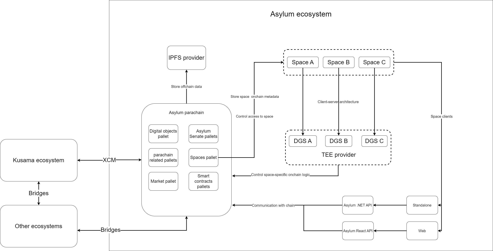

# Architecture

## The parachain architecture

- Parachain related pallets - pallet_system, pallet_balances, collator selection, etc.
- The Digital object pallet is responsible for Asylum items and blueprints.
- Spaces pallet is responsible for access control to spaces, i.e., the player should obtain a space pass. Also spaces pallet store Space on-chain data, such as space pass price, space client binary as a link to ipfs, space admins list, etc.
- Asylum Senate pallets are responsible for different DAO layers: blueprint DAO, space DAO, and global Asylum protocol DAO.
- Smart contracts pallets will be used for space-specific on-chain logic.
- The market pallet is responsible for different market protocols such as pools, item’s marketplace, etc.

## What is Space?

Asylum Space consists of:

- Space on-chain representation: both server and client of the space should be stored on-chain as ipfs hashes and be under the control of Asylum Space DAO;
- A dedicated game server (DGS) was deployed on TEE.
- Standalone or Web space client, which can communicate with chain directly in case DGS is not needed.
- Group of smart contracts, which can track and store sensitive space data on-chain.

## Decentralized Space backend

Our intention is to decentralize both space client and backend, so if Asylum users wish to deploy their own DGS, we will incentivize such a decision.

## Security

We want to allow DGS to have control over the user’s on-chain data, i.e., the user should insert his key to the TEE keystore so that TEE can change the user’s on-chain state. This leads us to the question of how to control code deployed on TEE to make it secure.