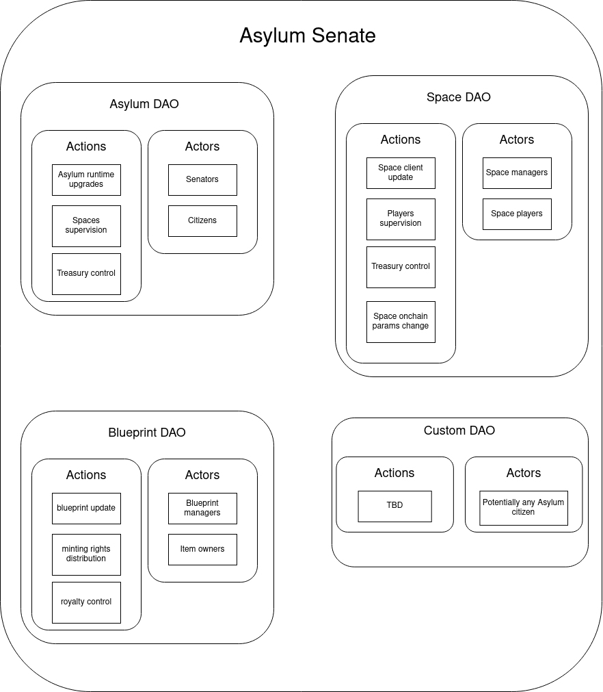

# Asylum Senate

## Asylum DAO

Asylum DAO is similar to Polkadot governance system, with councils and referenda.

## Space DAO

Space DAO obviously controls the Space onchain parameters, such as the space client version control, the space pass price, etc.

## Blueprint DAO

Blueprint DAO contols all stuff related to the Blueprint

## Custom DAO

TBD

## TBD

- Space DAO params
- Blueprint DAO params
- Who can vote in Space/Blueprint DAO
