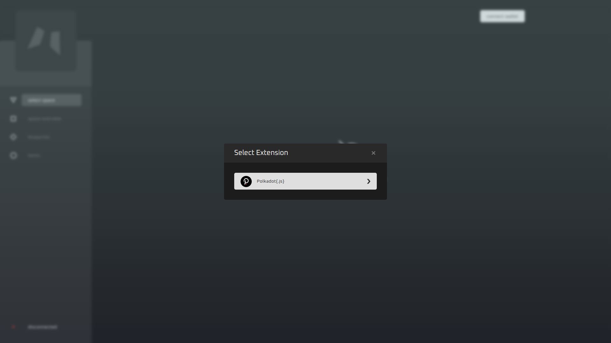

# Blueprints setup

### In this guide:
- initial setup
- configuring blueprints 
- configuring interpretations

### Step 1: Setup and run Creator Studio web app

Choose one of two options to install Creator Studio:
- [Docker setup](../asylum-ui/creator-studio/installation-docker) (Recommended)
- [Manual installation](../asylum-ui/creator-studio/installation-manual)

### Step 2: Configure PolkadotJS and connect to the local node:

1. [Install](https://polkadot.js.org/extension/) PolkadotJS browser extension.

2. Import seeder account using `SEEDER_MNEMONIC`.

3. Navigate to `http://localhost:3000` in the browser.

4. Click `disconnected` button and connect to the local node and local ipfs:
   

5. Click `connect wallet` button -> Select `Polkadot{.js} wallet` -> Select seeder account, which you have imported before:
  
  

6. After that, you will see the list of spaces associated with the seeder account. Select the first one, for instance:
   

7. You can click `space overview` button and check space metadata, which is configured by the seed script:
   

### Step 3: Configure Blueprint and Interpretations:

1. Navigate to the `blueprints` page and click `+ create blueprint` button. Here you have to fill in metadata related to the Blueprint (`Name`, `Description`). All Blueprints should have at least one visual Interpretation with `default-view` tag. This Interpretation can be used in the marketplace and represents general visual features of the blueprint.

   

2. Adding Tags affects the metadata of Interpretation. You can check the result in `Raw Metadata` field. **Consider tags as a verbal description of Interpretation**. Tags can carry metadata fields with predefined or configurable values, or even without any metadata, bringing specific semantics to the Interpretation (like the `pixeled` tag):  
   

3. After submitting Blueprint and signing a transaction, you can find the Blueprint using the search bar:
   

4. Click on the blueprint and check its metadata and Interpretations. You can add new Interpretation to the Blueprint or edit the existing one:
   

5. Let's add a new Interpretation with `pixeled tag`.

6. Adding Interpretations allows NFT items to have different representations within one or multiple spaces. Suppose we have two visually different spaces (2D and 3D) which want to share one NFT item. To make this possible, we have to add 3d interpretation.
   
7. Finally, we have set up our Blueprint with multiple visual Interpretations!
   

