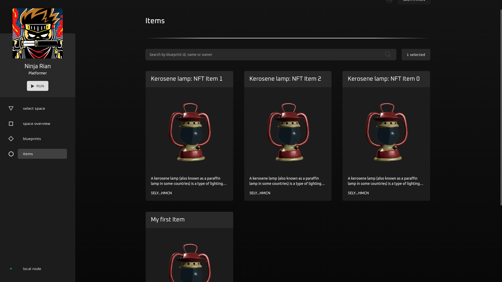

# Items Minting

### In this guide:
- mint NFTs for different accounts
- approval process
- 2d game space overview.

## Prerequisites

1. Choose one of two options to install Creator Studio:
   - [Docker setup](../asylum-ui/creator-studio/installation-docker) (Recommended)
   - [Manual installation](../asylum-ui/creator-studio/installation-manual)

2. [Install](https://polkadot.js.org/extension/) PolkadotJS browser extension.
3. Import seeder account you used during Creator Studio installation.
4. Navigate to `http://localhost:3000` in the browser.
5. Click `disconnected` button and connect to the local node and local ipfs:
   
6. Click `connect wallet` button -> Select `Polkadot{.js} wallet` -> Select seeder account, which you have imported before:
   
   

### Step 1: Minting items

1. Click `Mint item` button either from Blueprint Overview page or directly from Blueprints list. You'll see Mint Item window:
   

2. Here we can change `Name` and `Owner` of the item we're going to create. Owner's address is automatically filled with our own (blueprint owner) wallet. Let's change `Name` to `My first Item` field and leave `Owner` field as it is for now.
   

3. After that we can click 'Mint item' button, Polkadot will ask you to enter your wallet password and, hopefully, you'll see a successful minting notification
   

### Step 2: Items overview

1. Open `Items` page. Here we can see all items created by us and the seeding script. Let's find item that we minted previously. Click `Filter` button, select blueprint we used and click `Apply`
   

3. Now we can clearly see our item, but if needed you can use Search bar for additional narrowing by item name.
   

4. Let's click on our item and look at Item overview page
   
   We can see all information we may need about the item like Blueprint id, description and interpretations.

### Step 2: Minting items for another account

Let's mint another item. But this time for another wallet. In my case `Alice` (blueprint owner) will mint item for `Bob`
1. Mint item just like in the first step, but change owner's field to Bob's (or any other) address this time.
   

2. Let's change our account. Click on address (top right corner), press `change wallet` and select account you've minted item for.
   

3. Open `Items` page. You can see item you minted is pending approval
   

4. Let's click on it to open detail item overview and scroll to interpretations
   
   As we can see item awaits you to approve interpretation updates. Let's do it with `Approve all updates` button. Be aware that account should possess some tokens to successfully approve updates.

5. Now you can see items interpretations approved and `pending approval` status disappeared.
   

6. Let's change back to Alice's account and add another interpretation to this item
   

7. Now we can return to Bob's account, open our item and see that new (or edited) interpretations await approval.
   

8. We can accept them just like before with `Approve all updates` button.
   

### Step 3: Using items in-space

Let's finally use some of our items in the space!

> Bob doesn't have any spaces on his account and we didn't implement purchase mechanic yet so we should switch to Alice (seeder account) for now.

1. Open 'Select space' page, choose our space and click 'Run'
   

2. Select map that represent levels and choose any level
   
   

3. Open inventory (chest in the top right corner). Here you can equip and unequip items. As you can see sword is equipped and the character uses it in space
   
   
