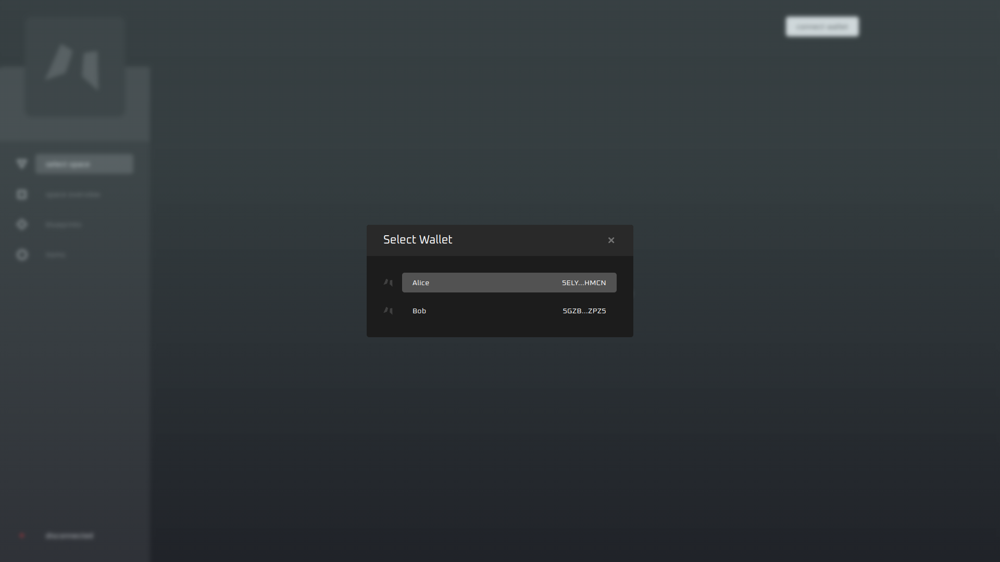
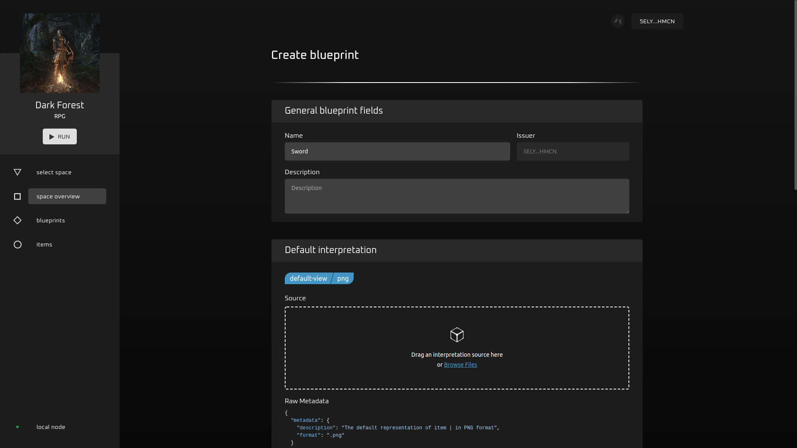
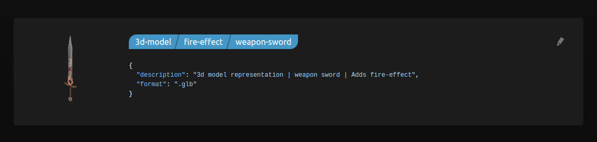
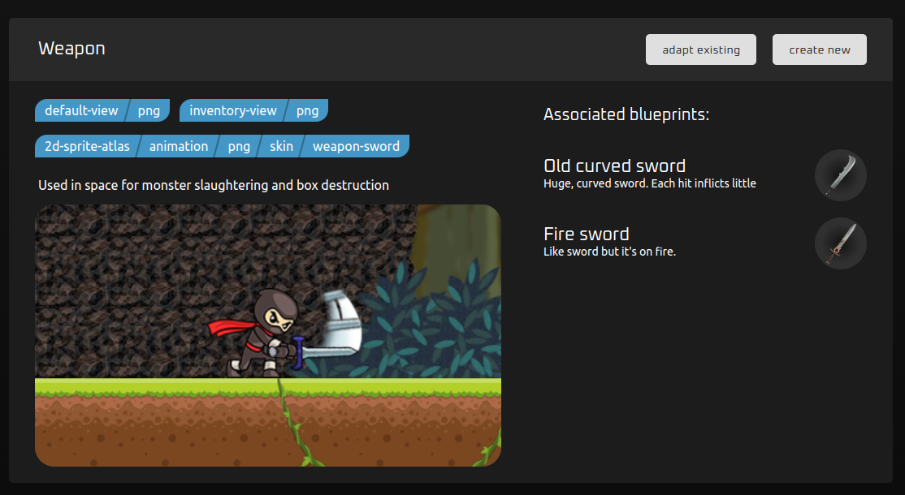
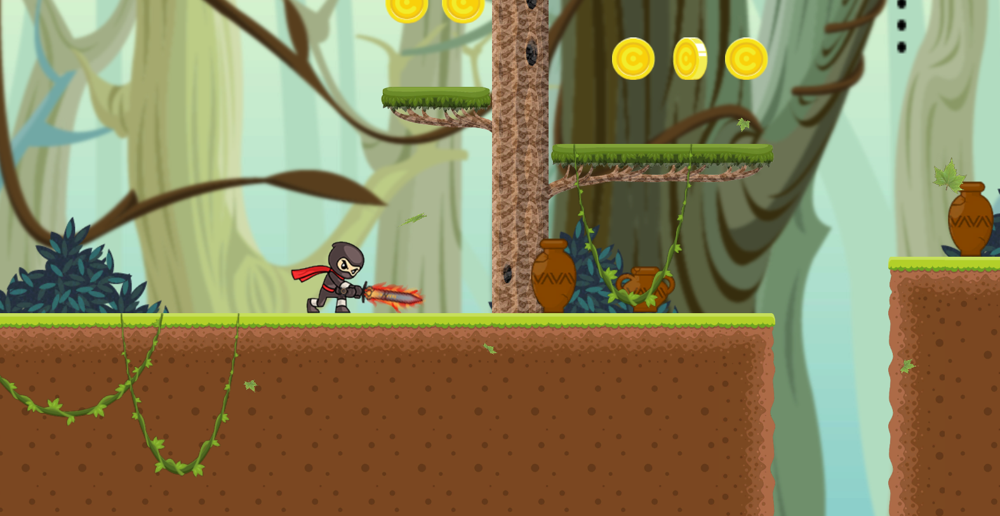

# Configure Patterns

## In this guide:
- action-RPG 3d-game
- patterns (new space-related entity)
- pattern-blueprints interconnections
- 3d viewer for Creator Studio

## Prerequisites

1. Choose one of two options to install Creator Studio:
   - [Docker setup](../asylum-ui/creator-studio/installation-docker) (Recommended)
   - [Manual installation](../asylum-ui/creator-studio/installation-manual)

2. [Install](https://polkadot.js.org/extension/) PolkadotJS browser extension.
3. Import seeder account you used during Creator Studio installation.
4. Navigate to `http://localhost:3000` in the browser.
5. Click `disconnected` button and connect to the local node and local ipfs:
   
6. Click `connect wallet` button -> Select `Polkadot{.js} wallet` -> Select seeder account, which you have imported before:
   
   

## Case 1: Creating a blueprint from a pattern

1. Open `select space` page.

2. Select <b>Dark Forest</b> (our new action-RPG game).

3. Open `space overview` page.

4. Scroll to <b>Supported Patterns</b>.

Here we can see the `Sword` Pattern. It defines in-space entity and interpretations needed for a blueprint to be associated with this particular pattern. 
In our case we already have a blueprint named `Old curved sword` adapted.  

  

5. Let's create another blueprint for this pattern!

Click `create new` button in the pattern card.  

  

6. Setup needed properties

Creator studio guides us to fill necessary fields with files and/or metadata. In this case, it prompts us to add `name` and `description` plus 3 interpretations: 
- default-view
- inventory-view
- 3d-model

You can use corresponding resources from [seeder files](https://gitlab.com/asylum-space/asylum-ui/-/tree/main/packages/connection-library/img/blueprints/fire-sword) to create a Fire Sword!.  

    

7. Click `submit` when you're satisfied with all data you added.

#### Verification

We can check if <b>Fire sword</b> was created successfully.

1. Open `blueprints` page.

You should see "Fire sword" there. Let's explore it. Click on sword to open the blueprint overview page.

  

2. Let's look closer at our 3d model.

Find the corresponding interpretation in the `Interpretations` section and click on the spinning sword model to open fullscreen gallery view.

  

Look at our 3d-model a little. What a cool sword!

3. Now we can mint an item from our blueprint.

Close our fullscreen gallery and click `mint item` in the top right corner of the page. Change name ot the item if you wish. Click `+ Mint item` again and fill in your Polkadot{.js} password to sign the transaction.

  

4. Let's finally check our sword in the game.

Click `RUN` button under the game cover to launch Dark forest. Click play in the game when it's loaded.

You should see your <b>Fire sword</b> in your character inventory.  

  

#### [Optional] Blueprint update

Hmmm. Seems we've forgotten to add an actual fire effect for our sword.

Let's add it.

1. Close the game (click on the arrow in the bottom left corner and then `close` button)

1. Open <b>Fire sword</b> blueprint again find the 3d-model interpretation and open the edit window (pencil icon)  

  

2. Add the `fire-effect` tag to it, click `edit interpretation` and sign your transaction in polkadot prompt.  

  

3. We should see interpretation with a brand-new fire-effect tag now.  

  

4. Let's check it in-game again.  

  

Hooray! It has a cool fire effect now in our game. Feel free to slaughter some monsters with it if you'd like to play our game a little.

## Case 2: Adapt blueprint to pattern

Now let's make <b>Fire sword</b> adapted for usage in Ninja Rian (first demo game by Asylum)

1. Go to `select space` page and select <b>Ninja Rian </b>

2. Open `space overview` page and find `Weapon` pattern for Ninja Rian.

  

Again, we can see only `Old curved sword` blueprint but not <b>Fire sword</b>. Seems it is missing some interpretations to be recognized by Ninja Rian.

We can solve it!

3. Click `adapt existing`

We can see a new page which asks us to select a blueprint for adaptation. Select our already familiar <b>Fire sword</b>. We can see it has <i>1 missed</i> interpretation.

 

Looks like we need to add 2d-sprite-atlas.  

  

4. Submit

After that you can, as usual, click `submit` and sign your transaction.

Now <b>Fire sword</b> supported by Ninja Rian.  

  

#### Verification

Let's launch the game. Select any level and open your inventory.  

  

We can use our <b>Fire sword</b> in Ninja Rian now!  

## Case 3: Interoperable Items and Drop

Performing some game conditions, player can receive special NFT items. Space Client can initiate Item minting for Player, and when NFT appears in block, Game Client renders Item directly in space.
The next steps guide you though the possible scenario, where Space Client drops Player some Items, and Player uses these items within different spaces.

1. Restart Asylum Node and reseed data ([see how to reseed data in Docker](../asylum-ui/creator-studio/installation-docker#reseed-storage)).
2. Start the `Ninja Rian` space and pass through the first level. Use 'WSAD' to move and 'JKL' for actions. One of the NPC is guaranteed to drop the `Old curved sword`.

3. Close the space and go to `Dark Forest`. You can equip the `Old curved sword` you just obtained in `Ninja Rian`. Pass through the level and kill a specific highlighted NPC, which will drop `Kerosene Lamp`.

4. `Kerosene Lamp` is working as a world exploring Item - its idea is to reveal hidden places. Equipping it will help you to find a Chest. Open the chest, and you'll find another Item - `Clover Leaf`.

5. Equipping `Clover Leaf`, you can find the green title above the character's HP bar. In this space it's used as an Item, which doesn't affect game balance.
6. Let's get back to `Ninja Rian` again. Equip `Clover Leaf`. Now you can passively earn unique coins, for which you can buy items in-game store.

7. Similarly, by equipping `Kerosene Lamp`, you can discover unreachable before spaces, where you can get more in-game goods helping proceeding levels.
