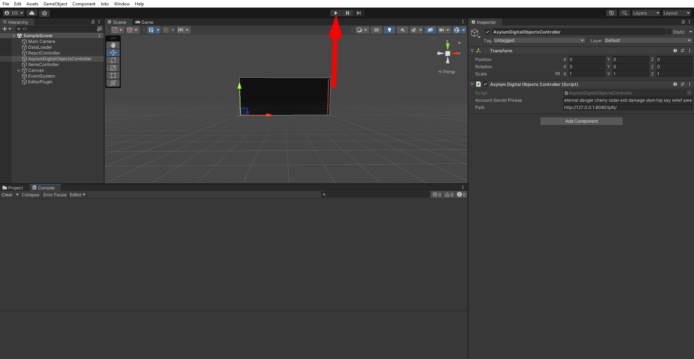
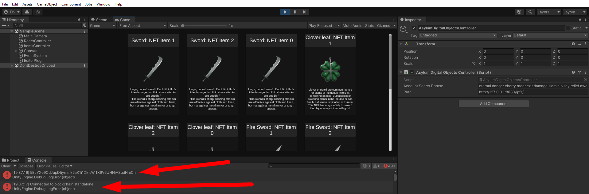

# Play Mode

You can simply test Asylum SDK plugin in Unity Play Mode without making a build.

1. After you have loaded the [Asylum Unity SDK Example](https://gitlab.com/asylum-space/asylum-unity-sdk-example) **or** added the [Asylum Unity SDK Plugin](https://gitlab.com/asylum-space/asylum-unity-sdk) to an existing project, create a GameObject with component [AsylumDigitalObjectsController](https://gitlab.com/asylum-space/asylum-unity-sdk/-/tree/main/AsylumSDK/AsylumDigitalObjectsController.cs). Make sure you enter the user's passphrase (seed phrase mnemonic) in the [AsylumDigitalObjectsController](https://gitlab.com/asylum-space/asylum-unity-sdk/-/tree/main/AsylumSDK/AsylumDigitalObjectsController.cs) component field.

    :::info
    If you followed Quick Install, you already have scene created, just open `Scenes/SimpleScene` and make sure that `AsylumDigitalObjectsController` component has seed phrase filled.
    :::
    
    

2. Follow the steps of [Docker setup](../../asylum-ui/creator-studio/installation-docker.md) and run the following command in terminal:
    ```
    docker compose up
    ```
   
    :::info
    Since you are not using WebGL it's not necessary to run Creator Studio. You can just run IPFS and Asylum Node.
    :::

    :::caution
    To see the proper result you should have items minted on your chain. To do this you can:
    - mint items manually from Blueprints: [Tutorials: Items Minting](../../tutorials/testing-guide-items-minting),
    - or reseed data with items using script: [Docker Setup: Reseed Data](../../asylum-ui/creator-studio/installation-docker#reseed-data)
    :::

4. And now you can start Unity Play Mode.

    

5. The final result should be this. In the console you should get the **Public Key** that was generated from the secret phrase. And you should also see a message about the correct connection to the blockchain.

    