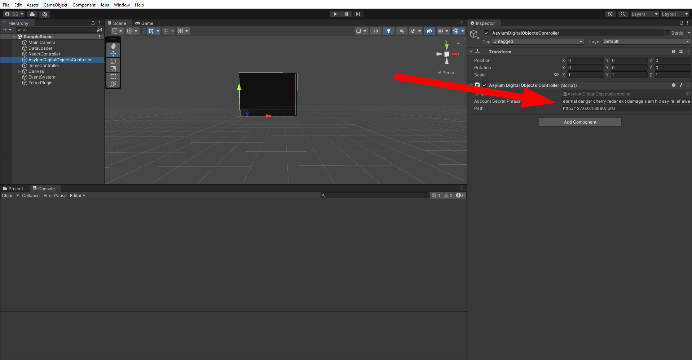
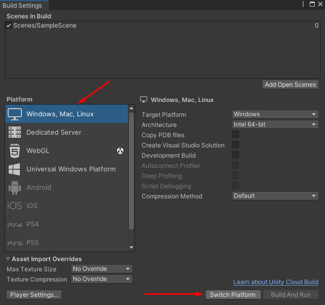
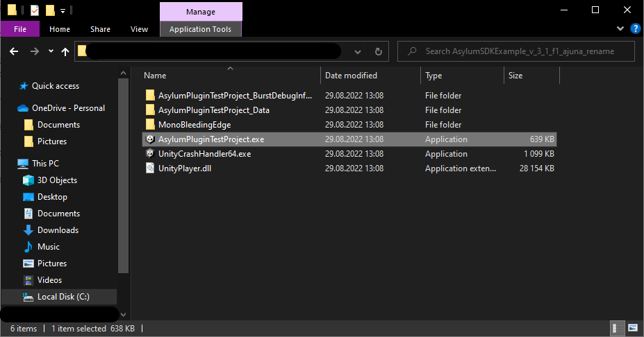
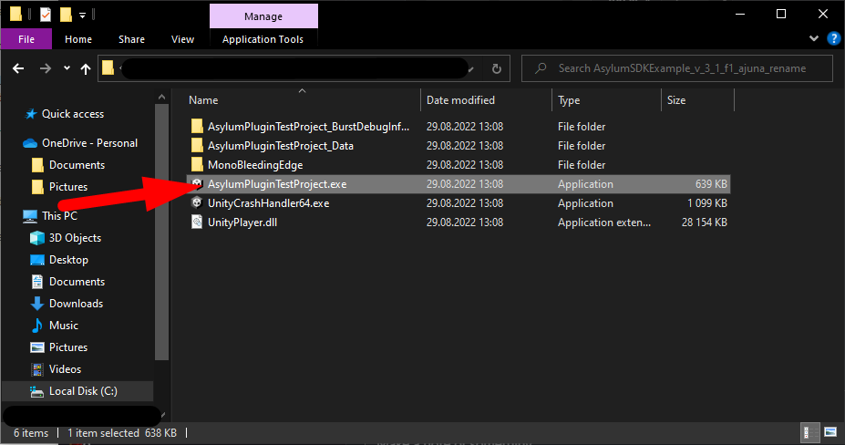
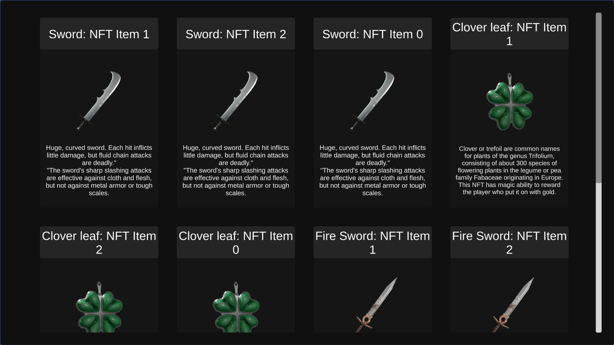

# Standalone

## Build and run Unity Standalone for Windows
1. After you have loaded the [Asylum Unity SDK Example](https://gitlab.com/asylum-space/asylum-unity-sdk-example) **or** added the [Asylum Unity SDK Plugin](https://gitlab.com/asylum-space/asylum-unity-sdk) to an existing project, create a GameObject with component [AsylumDigitalObjectsController](https://gitlab.com/asylum-space/asylum-unity-sdk/-/tree/main/AsylumSDK/AsylumDigitalObjectsController.cs). Make sure you enter the user's passphrase (seed phrase mnemonic) in the [AsylumDigitalObjectsController](https://gitlab.com/asylum-space/asylum-unity-sdk/-/tree/main/AsylumSDK/AsylumDigitalObjectsController.cs) component field.

    :::info
    If you followed Quick Install, you already have scene created, just open `Scenes/SimpleScene` and make sure that `AsylumDigitalObjectsController` component has seed phrase filled.
    :::
    

2. (Optional) Switch platform to the **Windows,Mac,Linux** in the **File > Build Settings**, if another platform is chosen.

    

3. Start building game. The result of the build looks like this.

    

4. [Download](https://docs.docker.com/get-docker/), install and run Docker.

3. Follow the steps of [Docker setup](../../asylum-ui/creator-studio/installation-docker) and run the following command in terminal:

    ```
    docker-compose up
    ```

    :::info 
    Since you are not using WebGL it is not necessary to run Creator Studio. You can limit yourself to running IPFS and Asylum Node.
    :::

    :::caution

    To see the proper result you should have items minted on your chain. To do this you can:
    - mint items manually from Blueprints: [Tutorials: Items Minting](../../tutorials/testing-guide-items-minting),
    - or reseed data with items using script: [Docker Setup: Reseed Data](../../asylum-ui/creator-studio/installation-docker#reseed-data)

    :::

6. And now you can start the game.

    

7. The final result should be this.

    
