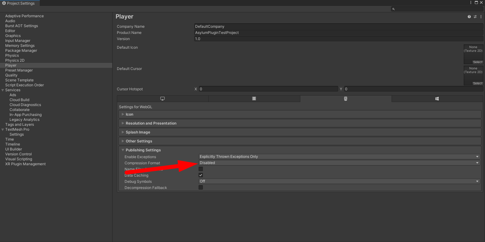
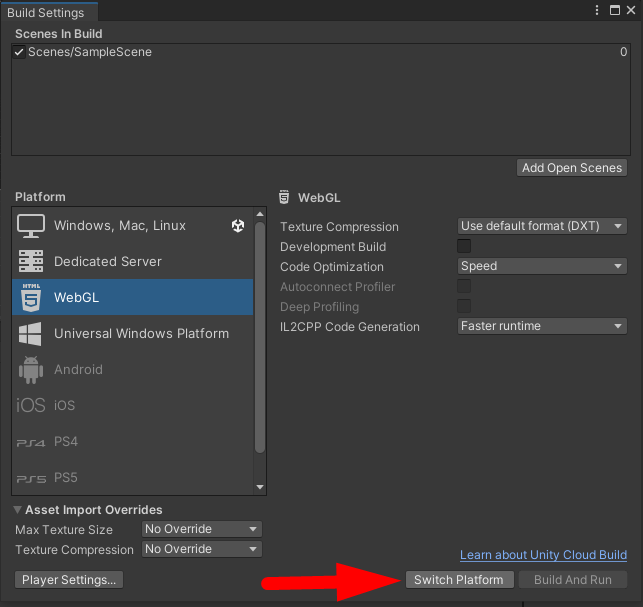
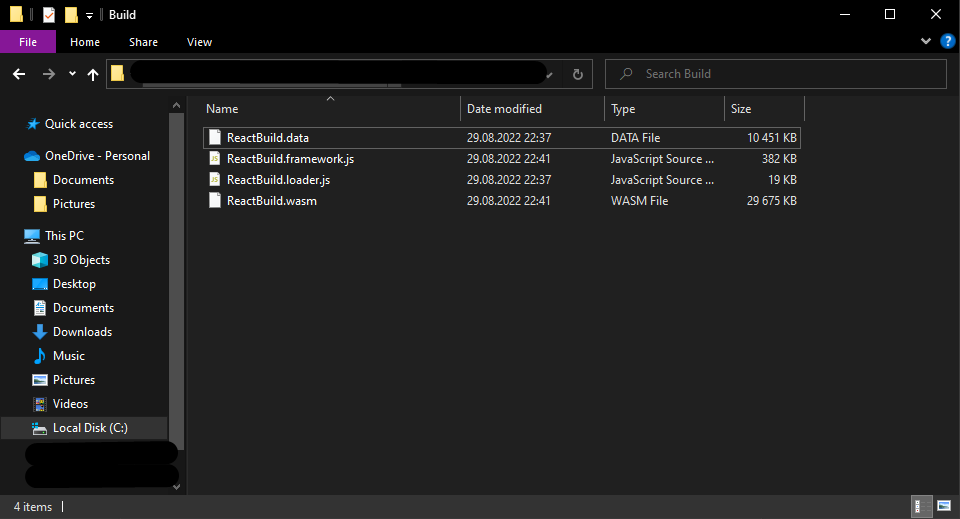
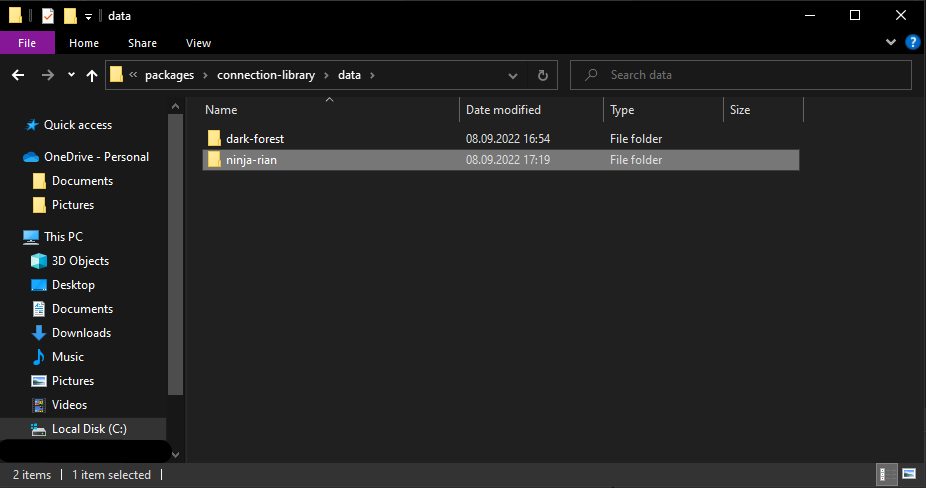
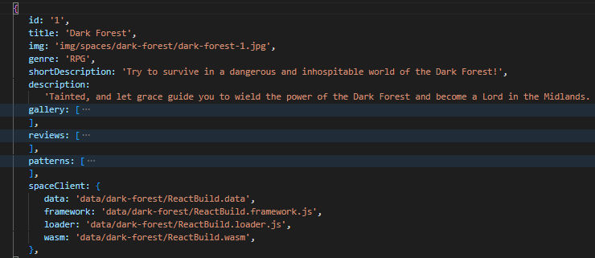
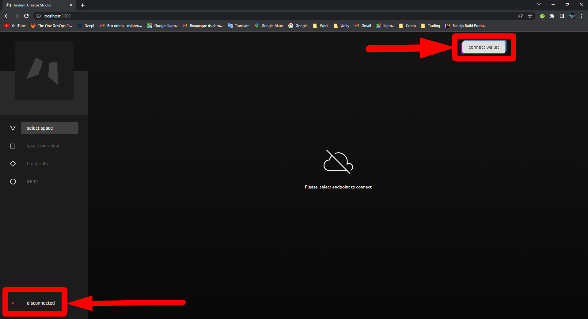
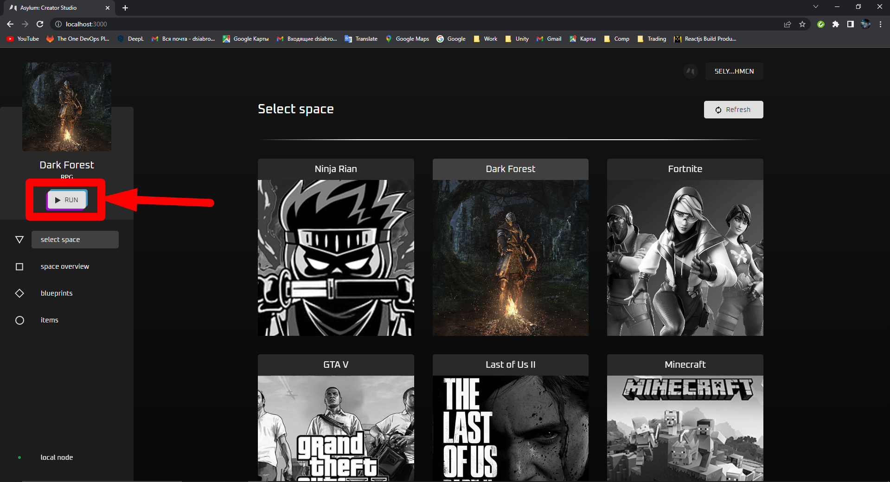
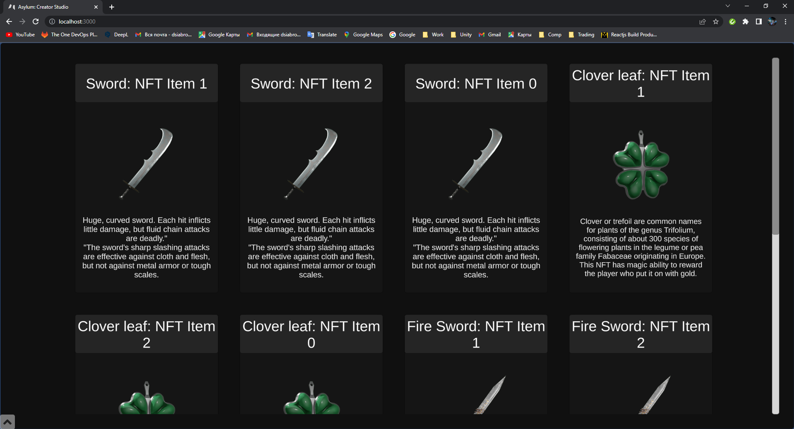

# React WebGL

## Run a Unity WebGL build inside Creator Studio
:::info
Before start, make sure you have installed WebGL for Unity. You can find download option in **File > Build Settings**
:::

1. Change the _Compression format_ in the **Edit > Project Settings > Player > WebGL settings > Publishing settings** to the _Disabled_

   

2. (Optional) Switch platform to the WebGL in the **File > Build Settings**, if another platform is chosen

   

3. Form WebGL build: **File > Build Settings > Build**. The output WebGL build contains 4 files in the `BuildDirectory/Build`:
    - BuildName.data
    - BuildName.framework.js
    - BuildName.loader.js
    - BuildName.wasm

   

4. Place these files inside `asylum-ui/packages/connection-library/data/build_name` and add new Space in `const spaces: ISpaceMockData[]` array in `asylum-ui/packages/connection-library/seed/mocks.ts`. Specify the correct paths to your Unity build in `spaceClient` and list of `supportedBlueprints` (if you run seed script, you will have default NFT blueprints with ids `[0, 1, 2, 3]`):
   ```ts title="asylum-ui/packages/connection-library/seed/mocks.ts"
   export const spaces: ISpaceMockData[] = [
   ...
   {
       id: 'space_id',
       title: 'Your Space',
       img: 'image_url',
       genre: '...',
       shortDescription: '...',
       description: '...',
       gallery: [...],
       supportedBlueprints: [0, 1, 2, 3],
       spaceClient: {
            data: 'data/build_name/BuildName.data',
            framework: 'data/build_name/BuildName.framework.js',
            loader: 'data/build_name/BuildName.loader.js',
            wasm: 'data/build_name/BuildName.wasm',
       }
   }
   ...
   ```

   
   
   

5. Follow the steps of [Docker setup](../../asylum-ui/creator-studio/installation-docker) and run the following command in terminal:

   ```
   docker-compose up
   ```

   :::caution
   If you had Docker setup before, you have to delete `asylum-ui` image and container and run `docker-compose up` again, otherwise new changes won't be applied.
   :::

    :::caution

    To see the proper result you should have items minted on your chain. To do this you can:
    - mint items manually from Blueprints: [Tutorials: Items Minting](../../tutorials/testing-guide-items-minting),
    - or reseed data with items using script: [Docker Setup: Reseed Data](../../asylum-ui/creator-studio/installation-docker#reseed-data)

    :::

6. Open a web browser and go to the `http://localhost:3000/`

7. Add the wallet and connect to the local node

   

8. Choose the space and press the **Run** button. 

   

9. The build is running

   
