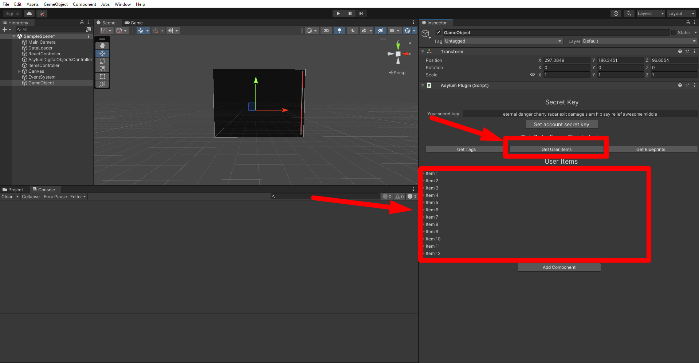

# Editor extension

There is a specially developed component called [AsylumPlugin.cs.](https://gitlab.com/asylum-space/asylum-unity-sdk/-/tree/main/AsylumSDK/AsylumPlugin.cs)
It is designed to interact with the blockchain without leaving Unity to simplify your development.

With the visual plugin that you can use in the Unity inspector, you can query all available blueprints or tags and see all information about them.
You can mint an item from any blueprint you choose.
It is also possible to query Items of a certain user with the help of a secret phrase, which you will need to specify in the component field.

## How to use Editor Extension?

1. The first thing you need to do is to download our [Asylum Unity SDK Example](https://gitlab.com/asylum-space/asylum-unity-sdk-example) **or** add the [Asylum Unity SDK Plugin](https://gitlab.com/asylum-space/asylum-unity-sdk) to the project.

2. Then you will need to create empty `GameObject` in the scene and then add to it the AsylumPlugin script component.

  

  

  :::info
  If you have downloaded our [example](https://gitlab.com/asylum-space/asylum-unity-sdk-example), then you can find this `GameObject` named "EditorPlugin" in the scene hierarchy.
  :::

3. Make sure you enter the user's passphrase in the [AsylumPlugin](https://gitlab.com/asylum-space/asylum-unity-sdk/-/tree/main/AsylumSDK/AsylumPlugin.cs) component field.

  

4. After that, press the button to set the secret phrase. Then you should see the logs about the correct connection and generation of the correct **PulicKey**.

  

  

5. You will have three new buttons with which you can request information and display it.

  

- This is what a **Tags** request looks like.

  
- This is what a **Blueprints** request looks like.

  

- This is what a **User Items** request looks like.

  

6. Also in the **Blueprint** tab you can mint an item by clicking on the **Mint Item button**.

  

- And then you can find new item in **User Items** tab

  

