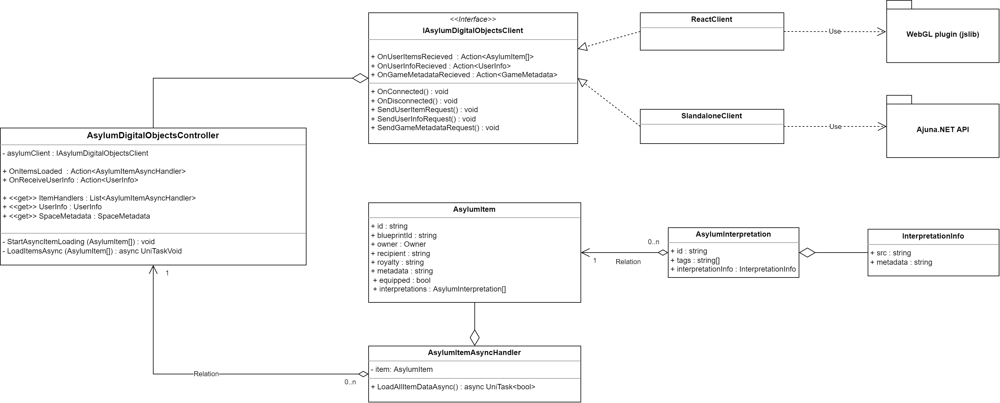

# Overview

:::info
Unity version supported: **2021.3.1f1**
:::

Provides plugins, editor scripts, and a set of utilities to integrate with the Asylum ecosystem.

The plugin is designed to work in **Unity Play Mode**, **WebGL build**, and **Windows, Mac, Linux Standalone builds**. Check [Installation](./installation) section.

## Plugin inwards

The plugin is designed to work within WebGL build and in Standalone mode (in Play mode or Desktop builds). For Standalone mode, it utilizes [Ajuna.NetApi](https://github.com/ajuna-network/Ajuna.NetApi) as a Substrate Client, whereas for WebGL build, it uses `jslib` approach.

Both methods implement the same [IAsylumDigitalObjectsClient](https://gitlab.com/asylum-space/asylum-unity-sdk/-/tree/main/AsylumSDK/IAsylumDigitalObjectsClient.cs) API. Check the UML classes diagram below:

- `jslib` - responsible for the connection between Unity and JS code, which runs the build
- `AsylumDigitalObjectsController.cs` - the script that defines the environment in which the Unity build is running, whether it's WebGL or Standalone. And defines the mechanism of work, either using ReactClient or StandaloneClient
- `AsylumEntities.cs` - contains types and entities you need to initialize Asylum NFT Items
- `ReactClient.cs` - implements [IAsylumDigitalObjectsClient](https://gitlab.com/asylum-space/asylum-unity-sdk/-/tree/main/AsylumSDK/IAsylumDigitalObjectsClient.cs) and responsible for connection between Unity life circle and `jslib`(WebGL), parsing and downloading on-chain data or send requests
- `StandaloneClient.cs` - implements [IAsylumDigitalObjectsClient](https://gitlab.com/asylum-space/asylum-unity-sdk/-/tree/main/AsylumSDK/IAsylumDigitalObjectsClient.cs) and responsible for standalone connection between Unity life circle and chain, parsing and downloading on-chain data or send requests
- `AsylumPlugin.cs` - responsible for the standalone connection between Unity Editor and chain, parsing and downloading on-chain data, or send requests
- `AsylumItem.cs` - contains a low-level object that stores various item parameters and references to its metadata, which is not loaded. The serialized class is created for JSON parsing.
- `AsylumItemAsyncHandler.cs` - describes an item handler that works with [AsylumItem](https://gitlab.com/asylum-space/asylum-unity-sdk/-/tree/main/AsylumSDK/AsylumEntities.cs) and turns it into a high-level object, loading all the necessary metadata and turning it from bytes to complex objects.
- `AsylumInterpretation.cs` - contains an id and a list of tags corresponding to the interpretation, and [InterpretationInfo](https://gitlab.com/asylum-space/asylum-unity-sdk/-/tree/main/AsylumSDK/AsylumEntities.cs). The serialized class is created for JSON parsing.
- `InterpretationInfo.cs` - contains links to the metadata and source interpretation for further download. The serialized class is created for JSON parsing.